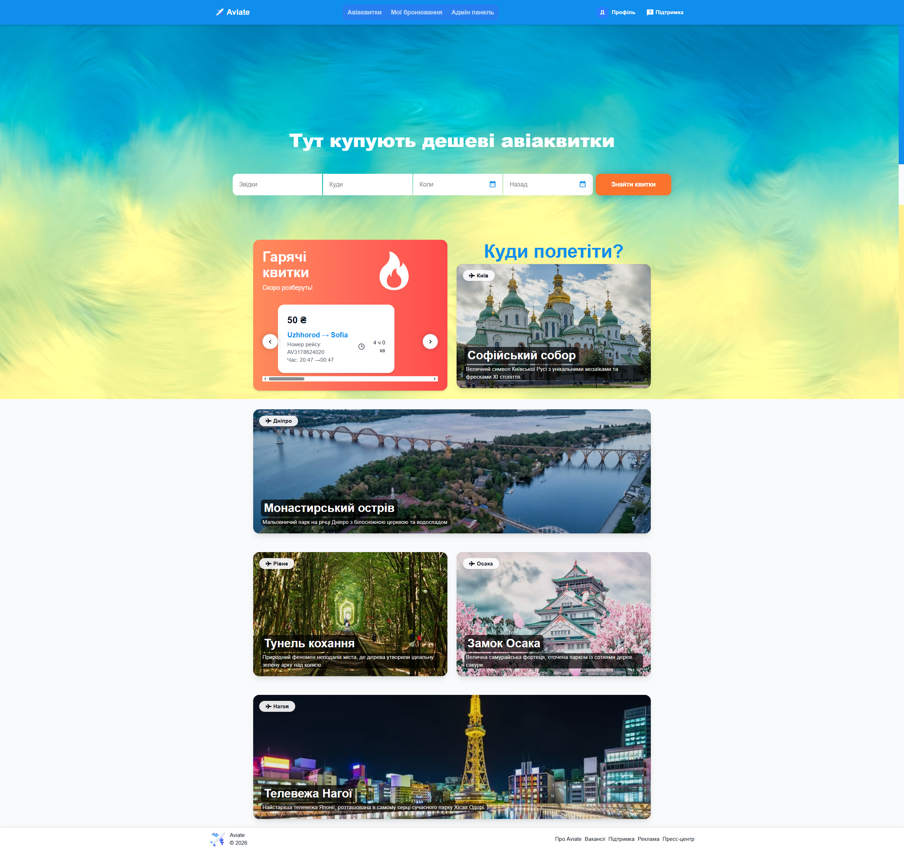
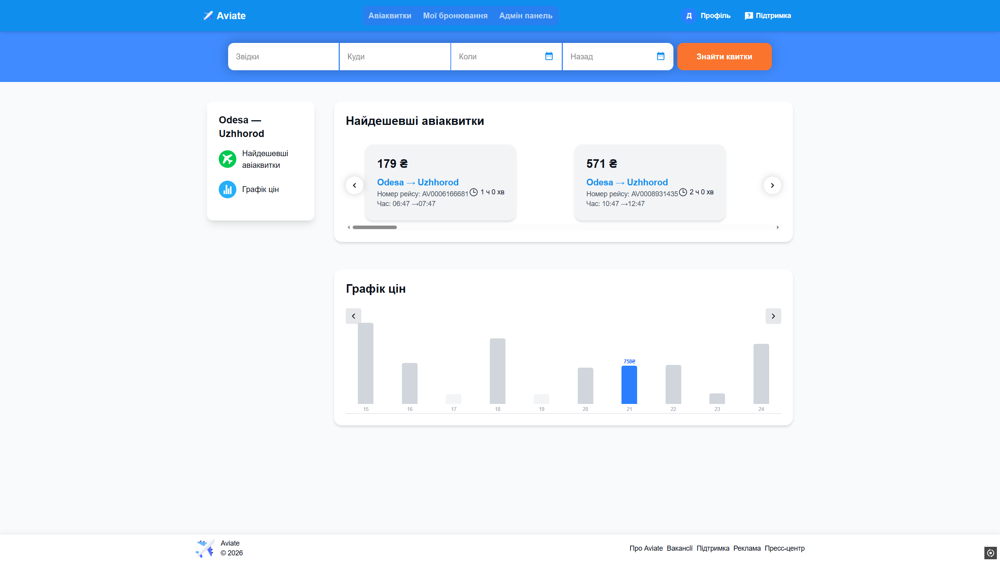
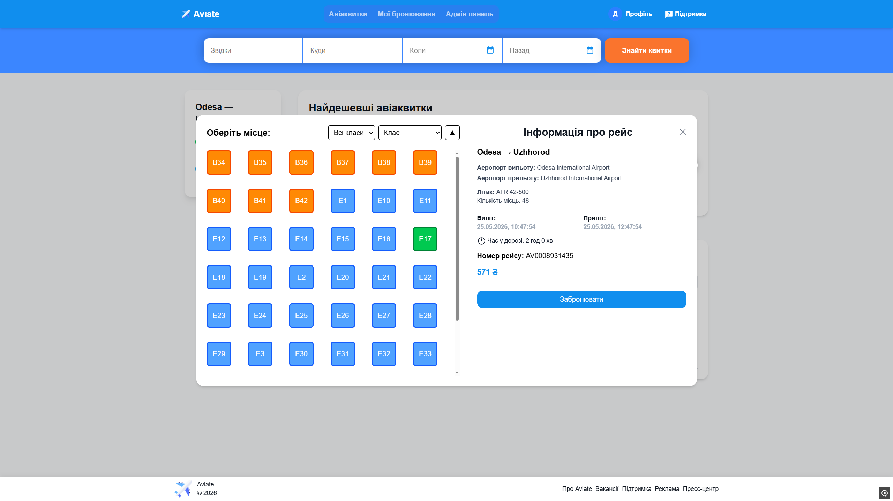
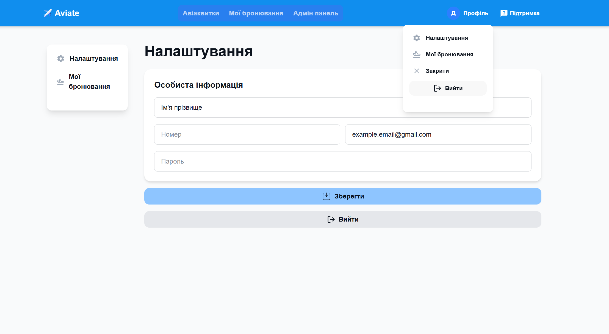
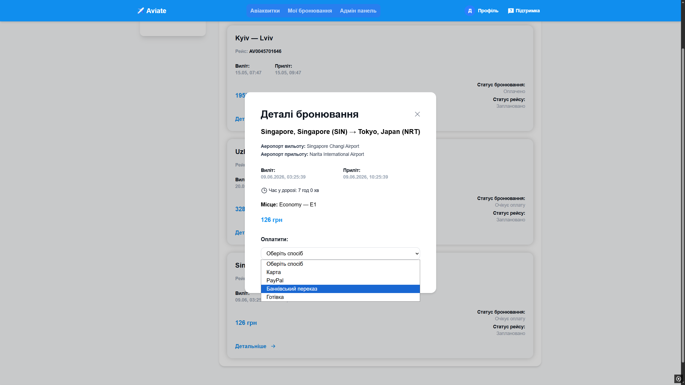
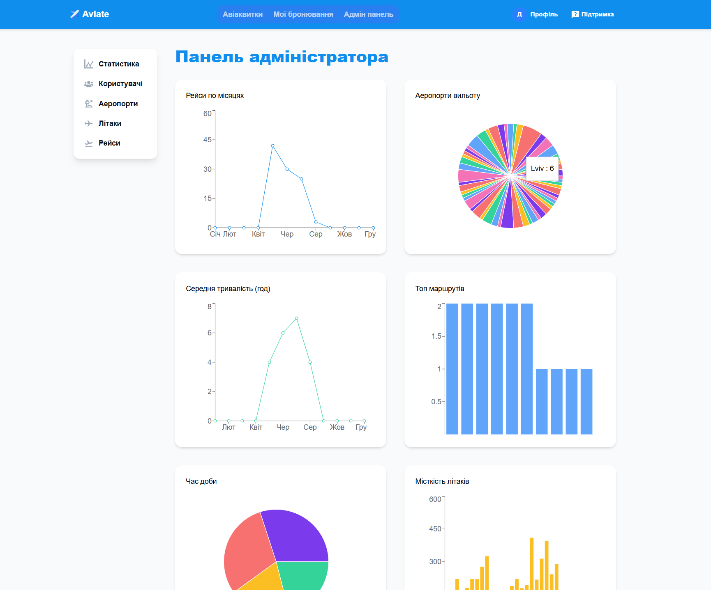
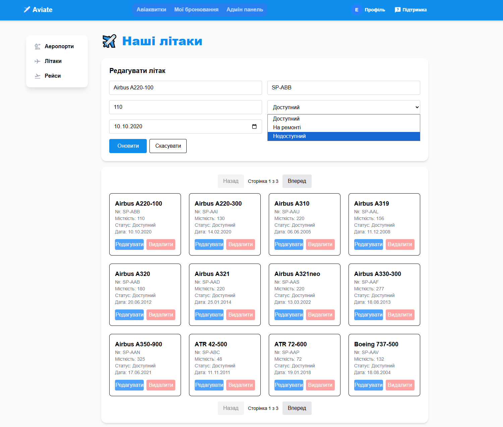
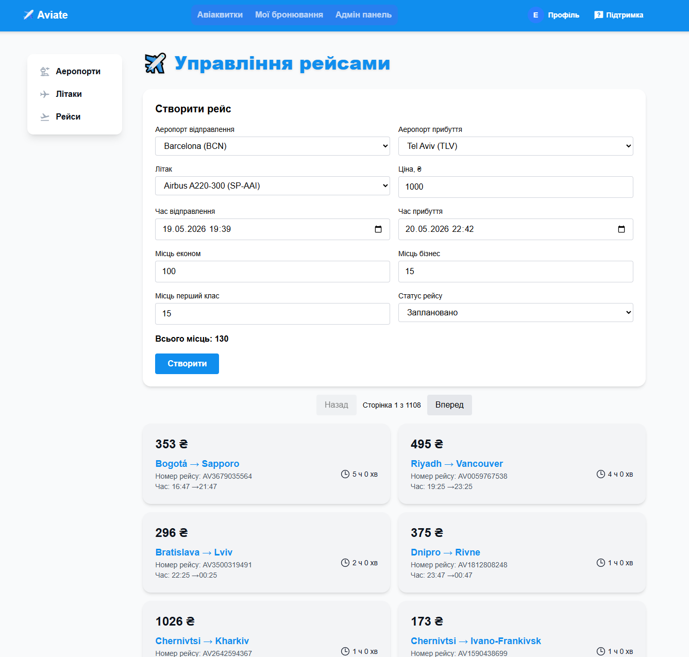
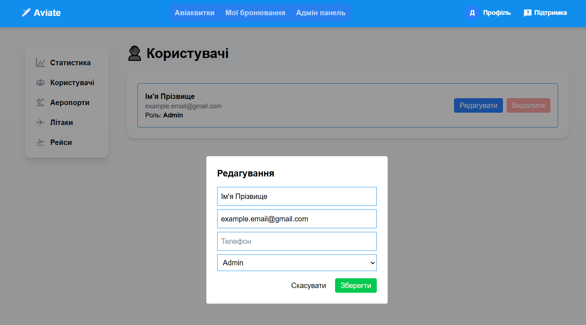
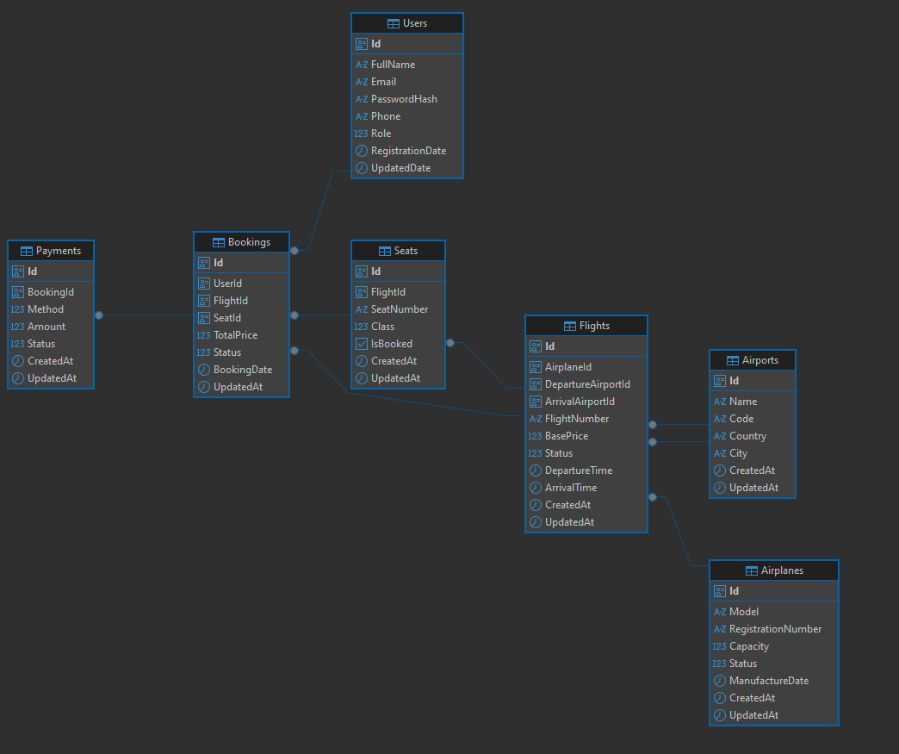

# ✈️ Aviate (Legacy Project)

Проєкт переведено у публічний доступ для демонстрації навичок розробки складних систем бронювання та обробки великих масивів даних.

> **⚠️ Увага:** Цей проєкт є частиною мого портфоліо фріланс-замовлень минулих років. Він позначений як **Legacy**, оскільки наразі не підтримується. Проєкт демонструє роботу з великими обсягами даних та реалізацію складних інтерфейсів.

### 🌟 Огляд проєкту
**Aviate** — це комплексна система для пошуку та бронювання авіаквитків. Ключовою особливістю є висока продуктивність бази даних, фільтрація та наявність інструментів для адміністрації.

**Основні можливості:**
*   **Пошук та фільтрація:** Пошук з автодоповненням аеропортів та графіком динаміки цін.
*   **Бронювання:** Інтерактивний вибір місць у літаку з урахуванням класів Economy/Business/First.
*   **Генератор даних:** Вбудована система генерації, що створює 6 000 рейсів за 2 хвилини та понад 1 000 000 місць у базі даних для стрес-тестування та демонстрації пошуку.
*   **Адмін-панель:** Розширена аналітика: графіки рейсів, популярні маршрути, статистика по місяцях та повний CRUD для керування авіапарком, аеропортами та користувачами.

### 🛠 Стек технологій
*   **Backend:** .NET 8, ASP.NET Core, Entity Framework Core, Clean Architecture, AutoMapper, FluentValidation.
*   **Frontend:** React, Next.js, Tailwind CSS, Recharts.
*   **Storage:** PostgreSQL.
*   **DevOps:** Docker Compose.

---

## 📸 Скріншоти інтерфейсу

### Головна сторінка та пошук
Інтерфейс пошуку з підтримкою автодоповнення та видачею найдешевших напрямків.



### Результати пошуку та графік цін
Візуалізація вартості квитків на сусідні дати для вибору найвигіднішої пропозиції.


### Вибір місця та оформлення
Вікно бронювання з поділом на класи та розрахунком вартості.


### Кабінет користувача
Керування профілем та перегляд історії бронювань.



### Панель адміністратора
Детальні дашборди з аналітикою трафіку, завантаженості аеропортів та активності користувачів.


### Управління даними адміністратором
Інструменти для додавання нових літаків та рейсів диспетчером.


Управління користувачами та керування правами доступу адміністратором.


---

## 🚀 Як запустити (Інструкція для розробника)

Щоб запустити проєкт, потрібно встановити:

- 🐳 [Docker](https://www.docker.com/get-started)
- 👾 [Git](https://git-scm.com/install/) (Опціонально)

### 1. Підняття контейнерів
#### Клонуйте репозиторій у зручному місці:
```bash
git clone https://github.com/Ephtianura/Aviate
```
*Ви також можете завантажити проєкт вручну zip-архівом, натиснувши вгорі зелену кнопку **Code** -> **Download ZIP***

#### Після цього виконайте команду в кореневій папці:
```bash
docker-compose up -d --build
```
### 2. Заповнення бази даних
База даних ініціалізується порожньою. Ви можете наповнити її через адмін-панель (включно з прихованою сторінкою генерації рейсів) або імпортувати готовий дамп.

Для імпорту дампу виконайте у терміналі:
```bash
docker exec -i aviate_postgres psql -U postgres -d Aviate < dump.sql
```
*Файл dump.sql має бути в тому ж каталогу, де виконується команда*

---

## 🏗 Структура бази даних (ER-модель)
Проєкт використовує нормалізовану структуру PostgreSQL:

*   **Airplanes:** Облік моделей, реєстраційних номерів та місткості літаків.
*   **Airports:** Довідник аеропортів.
*   **Flights:** Розклад рейсів, прив'язка до бортів та базова ціна.
*   **Seats:** Динамічна сітка місць для кожного окремого рейсу.
*   **Bookings & Payments:** Логіка транзакцій та статусів бронювань.
*   **Users:** Система ролей та автентифікація.



---

## 📝 Нотатки
*   **Архітектура:** Проєкт реалізовано згідно з принципами Clean Architecture. Код розділений на шари Domain, Application, DataAccess та Infrastructure для кращої тестованості.
*   **Контент:** Зображення на головній сторінці захардкоджені та підтягуються рандомно для візуальної різноманітності.
*   **Генерація:** Сторінка з генерацією навмисно прихована та відкривається за адресою http://localhost:3004/admin/generate. Перед запуском потрібно двічі надати підтвердження. Рекомендується спочатку наповнити звичайні рейси, потім українські.
*   **Демонстрація:** Для заповнення бази даних генерацію було запущено 4 рази. Ця дія згенерувала 22 000+ рейсів та 4 100 000+ місць. dump.sql має розмір 700 MB+, тому він не був включений у проєкт.

*Розроблено як фріланс-проєкт. Усі права та торгові марки належать їх власникам.*